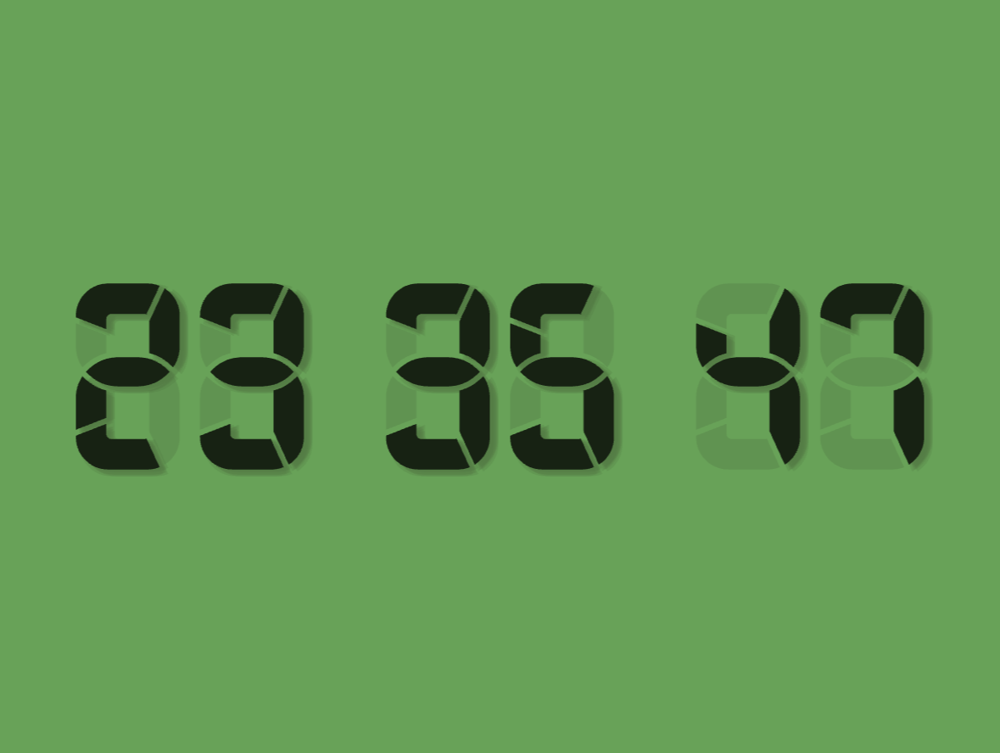

# Detonato



A stopwatch/counter and pomodoro timer built with OpenGL, using [Posy's beautiful 7-segment digit designs](https://www.youtube.com/watch?v=RTB5XhjbgZA).

## Building

Requires GLFW3 and a C compiler.

```sh
make
./detonato
```

`make` builds two binaries: `detonato` (the timer) and `preprocess` (the style baker, see below).

## Preprocessor

Posy's digit designs are authored as SVGs in `assets/`. The runtime doesn't parse SVG directly — instead, a separate `preprocess` binary bakes each SVG into a compact `.bin` file in `styles/` that `detonato` loads at startup.

### What it does

1. **Parses the SVG** with nanosvg, one `NSVGshape` per physical segment piece.
2. **Flattens** each cubic Bézier path into a polyline (30 subdivisions per curve).
3. **Tessellates** each contour into triangles via libtess2, respecting the SVG fill rule.
4. **Normalizes** all vertices into unit space `[0, 1]` using the SVG viewbox.
5. **Concatenates** every segment's triangles into a single flat vertex buffer, with per-segment `(start, count)` offsets so segments can be drawn individually with `glDrawArrays`.
6. **Renders the result** in a window so you can eyeball the tessellation before committing.
7. **Writes a `.bin`** to `styles/` containing the `DigitStyle` struct (aspect ratio, segment count, per-digit bitmask, vertex buffer).

### Segment bitmask

Each style has a hand-authored `segment_bitmask[10]` table — one `uint64_t` per decimal digit where bit `i` is set if segment `i` is lit for that digit. This lets the runtime draw any digit by iterating the bits and calling `draw_range` per lit segment.

The bit index corresponds to **SVG path order**, so reordering shapes in Inkscape silently invalidates the bitmask. Author the map once per style, verify visually, and don't touch the path order afterwards.

### Running the preprocessor

```sh
./preprocess assets/sports.svg
```

It'll open a window showing the tessellated digit. Press Enter to write `styles/sports.bin`. Repeat per style.

## Credits

- 7-segment digit shapes by [Posy](https://www.youtube.com/watch?v=RTB5XhjbgZA)
- [libtess2](https://github.com/memononen/libtess2) for SVG path tessellation
- [nanosvg](https://github.com/memononen/nanosvg) for SVG parsing
- [glad](https://github.com/Dav1dde/glad) for OpenGL loading
